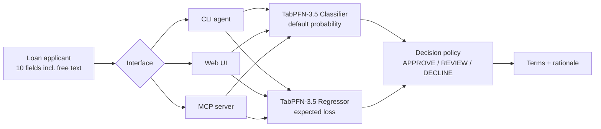
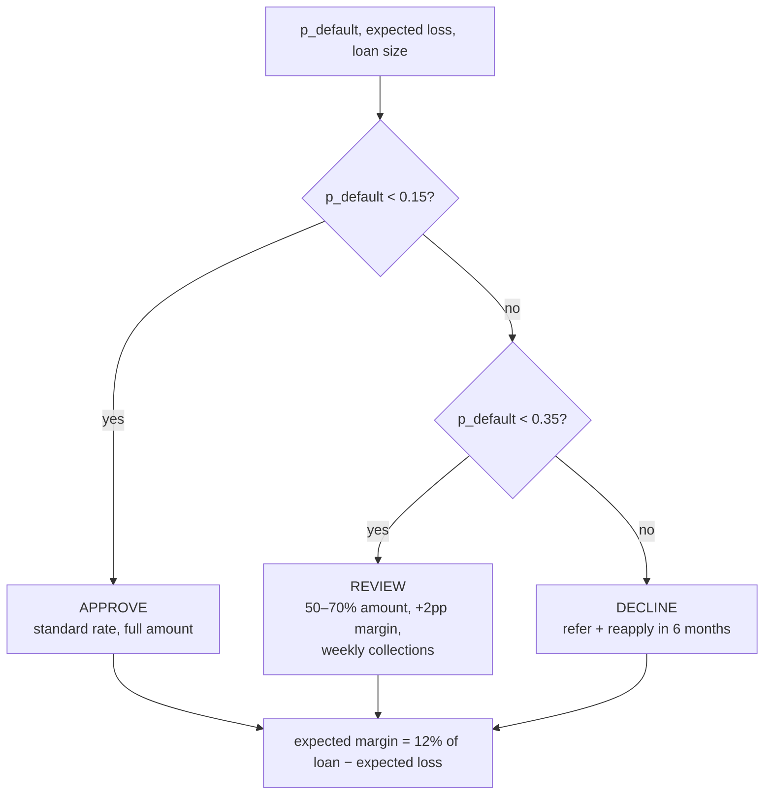

# CreditDesk — thin-file SME underwriting with TabPFN-3.5

A loan-officer **agent** for lenders whose borrowers have no credit history.
30–240 portfolio rows in context, raw text + categoricals + numerics with
missing values straight into **TabPFN-3.5** (Prior Labs hosted API) — out comes
a priced decision: approve, review-with-terms, or decline, with expected loss
and a plain-language rationale.

🎬 Demo video: [`demo.mp4`](demo.mp4) (64 s, narrated)

## The problem

Micro-lenders, SACCOs, and SME funds routinely face borrowers with **thin
files**: 1–2 years in business, patchy self-reported cashflow, a one-line
business description instead of financials. Classical scoring needs big clean
histories these borrowers don't have — so they get rejected by default, not by
risk. Nobody treats a 100-row dusty ledger as a machine-learning problem.
CreditDesk does.

## How it works



One shared core (`creditdesk/models.py`) serves all three interfaces. There is
no training pipeline, no feature store, no encoder: the portfolio CSV is the
model's context, TabPFN-3.5 does in-context inference per decision (~5–10 s
via hosted API, no local GPU).

The decision policy prices risk, not just ranks it:



## The three interfaces

**1. CLI agent** — predicts, then acts like a loan officer:

```bash
python -m creditdesk.agent --applicant examples/applicant.json
python -m creditdesk.agent --csv data/applicants_demo.csv --out results/decisions.csv
python -m creditdesk.agent --applicant examples/applicant.json --thinking  # thinking mode
```

Real output (live TabPFN-3.5 call, 120-row context):

```json
{
  "applicant": "noodle cart near bus station, cash only",
  "default_probability": 0.438,
  "expected_loss_usd": 3174.61,
  "decision": "DECLINE",
  "terms": "refer to financial-literacy program, reapply in 6 months",
  "rationale": ["2 late payments in 12m vs median 1",
    "under 2 years in business — thin track record",
    "sector 'street food stall' defaults at 43% vs 28% portfolio average"]
}
```

**2. MCP server** — any agent can underwrite (stdio transport, `mcp>=1,<2`):

```json
{"mcpServers": {"creditdesk": {"command": "python",
  "args": ["creditdesk/mcp_server.py"], "cwd": "/path/to/creditdesk-tabpfn",
  "env": {"TABPFN_TOKEN": "<key>"}}}}
```

A copy-paste config lives in [`examples/claude_desktop_config.json`](examples/claude_desktop_config.json).
Tools: `underwrite` (one applicant → proba + loss + decision + rationale),
`batch_screen` (many applicants), `model_card` (sweet spots, knobs, caveats).

**3. Web UI** — one-page FastAPI demo: fill the form, TabPFN-3.5 decides.

```bash
uvicorn app:app --port 8321
```

## TabPFN-3.5 showcase

Every prediction in this repo flows through TabPFN-3.5; the 3.5-specific
capabilities exercised:

- **Hosted 3.5-family models** via `tabpfn-client` (`TabPFNClassifier` /
  `TabPFNRegressor`, latest model) — no local GPU, ~seconds per decision.
- **Raw text in the table**: `business_description` ("noodle cart near bus
  station, cash only") goes in uncleaned. The generator gives text signal
  *beyond* the sector label (cash-only riskier, regulars/deposits safer), so a
  model that truly reads text has an edge one-hot can't match.
- **Native missingness**: 15% holes in soft self-reported columns
  (`debt_to_income`, `late_payments_12m`, `avg_monthly_cashflow_usd`).
  TabPFN reads `NaN` directly; baselines need median/mode imputation.
- **Thinking mode**: `--thinking` flag / `thinking` tool arg spends extra
  compute on the thinnest tables.
- **Few-shot learning curve**: `benchmark/run.py` compares TabPFN-3.5 against
  tuned XGBoost and scaled logistic regression (one-hot + imputed + scaled,
  encoders fit on train only) at 30/60/120/240 rows, 3 seeds, held-out AUC:

| n_train | TabPFN-3.5 | + thinking | XGBoost | LogReg |
|---|---|---|---|---|
| 30 | 0.583 | 0.590 | 0.578 | 0.575 |
| 60 | 0.543 | 0.552 | 0.575 | 0.539 |
| 120 | 0.574 | — | 0.604 | 0.646 |
| 240 | 0.578 | — | 0.581 | 0.605 |

Mean AUC over seeds 7/21/42; stds ≈ 0.03–0.08 overlap everywhere. Honest read:
a **tie**, where TabPFN pays no preprocessing tax and the baselines need a
full pipeline (imputation + one-hot + scaling + tuning). Full numbers and plot
in [`results/`](results/) — regenerate with `python benchmark/run.py` (needs a
`TABPFN_TOKEN` with quota).

## Hackathon fit

Built for the [TabPFN-3.5 Hackathon](https://platform.priorlabs.ai/hackathon-3.5)
(open-ended; panel picks top 3 + honorable mentions). One repo hits three
suggested tracks:

| Track | How |
|---|---|
| Build an agent | CLI loan-officer agent that predicts *and acts* (terms, margin, rationale) |
| Extension / app | MCP server + live web app, setup = `pip install` + one env var |
| Formalize a new problem | Thin-file SME default prediction: a domain dataset nobody treats as tabular |

Judging criteria mapping:

| Criterion (weight) | Evidence |
|---|---|
| Showcase of TabPFN-3.5 (50%) | 3.5 is the entire prediction core (classifier + regressor + thinking + text + NaN); benchmark vs baselines committed in `results/` |
| Creativity & originality (30%) | Thin-file underwriting agent for unscorable borrowers; text-that-matters formalization |
| Technical quality & reproducibility (20%) | Seeded data generator, pinned `requirements.txt`, smoke test, one-command repro, Apache-2.0 |

Submission compliance: public repo, Apache License 2.0 (`LICENSE`), description
above is written so a third-party developer can comprehend and reproduce the
project. Demo video in `demo.mp4` (build script: `video/make_slides.py`).

## Quickstart

```bash
pip install -r requirements.txt
export TABPFN_TOKEN="<key from https://platform.priorlabs.ai/account>"
python data/generate.py                      # seeded portfolio -> data/portfolio.csv
python -m creditdesk.agent --applicant examples/applicant.json
uvicorn app:app --port 8321                  # demo UI at localhost:8321
python benchmark/run.py                      # 3-seed benchmark -> results/
python -m pytest tests/                       # live smoke test (needs token + quota)
```

## Repo map

- `data/generate.py` — seeded synthetic portfolio (400 rows, text signal, 15% missingness)
- `data/portfolio.csv` — generated portfolio (committed for exact repro)
- `data/applicants_demo.csv` — 5-applicant demo batch (mixed outcomes + a NaN row)
- `creditdesk/models.py` — TabPFN-3.5 fit/predict, decision policy, rationale
- `creditdesk/agent.py` — CLI agent (single JSON or CSV batch)
- `creditdesk/mcp_server.py` — MCP tools over the same core
- `app.py` — one-page demo UI (FastAPI)
- `benchmark/run.py` — 3-seed learning-curve benchmark
- `results/` — committed `benchmark.json` + `learning_curve.png`
- `tests/test_smoke.py` — live end-to-end test (needs `TABPFN_TOKEN`)
- `examples/` — sample applicant + MCP client config
- `video/` — demo-video slide generator + voiceover; `demo.mp4` at root

## Caveats

Demo portfolio is synthetic (seeded, reproducible — same seed, same rows).
Retrain on your own ledger before any real lending decision. Prior Labs API
quota applies (free tier is 5M tokens/day); every number in `results/` and the
sample output above came from real metered API calls.
